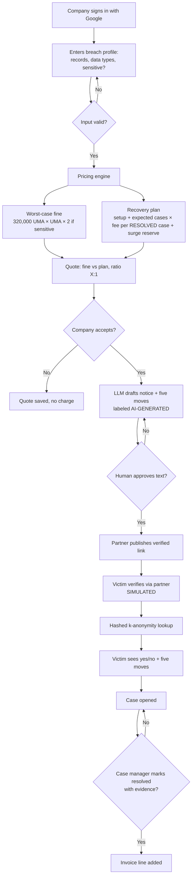
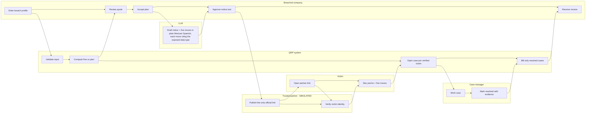

# PACKET — Week 8 · Money · Josep Ferré Gil (Team 7)

**Working name:** *Quien Rompe, Paga* (QRP) — the breached company funds recovery for the people it exposed.
**Vacuum:** Breach-victim service · **Blueprint declaration:** business model for a victim-recovery service funded by breached companies · **Honors Condition #4** (revenue tied to outcomes) plus #1, #2, #3, #5, #6.

> All data in this product is **invented and labeled SIMULATED**. All pricing numbers are **illustrative assumptions to be validated**, not market data.

---

## 1. Problem (in my words)

In Mexico the cost of a data breach lands on the victim, not on the company that leaked. In H1 2025 banks returned about a quarter of fraud claims, and identity-theft victims recovered roughly one tenth. The company that caused the breach pays almost nothing, so nobody builds the service that helps victims recover. My slice tests the missing piece: **a way for a breached company to buy victim recovery, priced so it only pays for victims actually helped.** If the price and the proof are clear, the company has a reason to write the check today instead of staying silent.

## 2. Exact user

**Primary (the payer):** Lic. Andrea Treviño *(invented persona)*, compliance lead at a mid-size SOFOM (microlender) in Puebla with ~500,000 customers. 48 hours ago their customer database leaked. Her insurance broker sent her a link. She needs, today: what this could cost the company, what it costs to protect the victims, and a document she can take to the CFO.

**Secondary (the beneficiary, minimal screen):** Lupita, 52, fonda owner *(invented persona from the User brief)*. She reaches the service only through a link published by a trusted partner, verifies herself through that partner, and sees **yes/no + five moves**. She never pays.

## 3. Success definition

**Before the module closes:** a breached company can sign in with Google, enter a breach profile, and get a quote comparing its worst-case fine against an outcome-priced recovery plan; a case manager can mark simulated victim cases resolved with evidence; and **the invoice changes only when a case is resolved** — never when a notification is sent.

## 4. Mockup (image-generated)

`` ← generate and drop in `docs/mockup.png`.

Prompt for the image generator:
> Clean web dashboard screen in Spanish for a Mexican B2B service called "Quien Rompe, Paga". Left: a form with fields "Registros afectados", "Tipo de datos (CURP, INE, teléfono, datos financieros)", "¿Datos sensibles?" toggle. Right: two large cards side by side — red card "Multa máxima LFPDPPP: $75,000,000 MXN" and green card "Plan de recuperación: $8,150,000 MXN — solo pagas por víctima resuelta". Below: a bar showing "Relación 9:1". Bottom: a small table "Casos: 120 abiertos · 34 resueltos · Facturable: $27,200". A small grey badge "DATOS SIMULADOS" in the corner. Flat design, white background, navy and green accents, desktop browser frame.

## 5. Flow

### 5.1 Flowchart — how the feature works

### 5.2 Swimlane — who does what

## 6. Benchmark

**The best existing solution on Earth for this is** US breach-response services (Experian Data Breach Resolution, Kroll), where the breached company pays per enrolled victim for identity monitoring and restoration.
**Mine differs by** charging per victim **resolved** instead of per victim enrolled, selling it before the breach through cyber-insurance retainers (because Mexican enforcement is weak), and localizing identifiers and channel to CURP, phone and WhatsApp with hashed lookups instead of credit-file monitoring.

## 7. Long view (3 years)

If this slice works, QRP becomes the default "notify and protect" line item inside Mexican cyber-insurance policies and incident-response retainers, activated automatically when a covered company is breached. Behind it runs a WhatsApp-and-voice recovery desk with contracted surge capacity, paid by breached companies, banks that want fewer CONDUSEF complaints, and employers who offer it as a benefit. The data it accumulates is not leaked records but outcome data — how long a fake loan takes to cancel, which institution answers — which becomes the evidence base for pricing, and for the regulator when the law finally arrives.

## 8. Scope cut — what I am NOT building

- No real breach data, no scraping, no dark-web anything. Breach index is invented.
- No real identity verification: partner login and INE check are **SIMULATED** buttons, labeled.
- No real WhatsApp sending, voice, or payments. Invoice is a computed number, not a charge.
- No case-management workflow beyond open → resolved with an evidence note.
- No password checking, no antivirus (Forbidden Zone).
- No legal advice: fine figures are statutory ceilings, shown with a "verify with a lawyer" note.

## 9. Pricing model (the Money core)

| Variable | Default (illustrative) | Why |
|---|---|---|
| UMA value | config, ~MX$117 | Brief: 320,000 UMA ≈ MX$37.5M. Verify 2026 value. |
| Fine ceiling | 320,000 × UMA, ×2 if sensitive | LFPDPPP 2025 ceiling |
| Activation rate | 2% of records | Share of exposed people who will seek help. **Biggest unknown.** |
| Setup fee | MX$150,000 | Notice drafting, partner link, onboarding |
| Fee per resolved case | MX$800 | Months of follow-up per victim (IDCARE-style) |
| Surge fee | +30% on cases above contracted capacity in first 72h | Blueprint Bet 3 |
| Pre-breach retainer | MX$X/month via insurer | Tests Bet 1 "before the breach" path |

**Quote = setup + (records × activation × fee per resolved case) + surge reserve.**
**Invoice = setup + Σ resolved cases × fee (× 1.3 if surge).**
Honest note shown on screen: the ratio compares against the *legal ceiling*; with weak enforcement the real driver is reputational risk.

## 10. Architecture + stack

| Layer | Choice (free tier) | Notes |
|---|---|---|
| Frontend + API routes | Next.js on Vercel | Two deploys minimum |
| Auth | Supabase Auth, Sign in with Google | Company users only |
| DB | Supabase Postgres, **RLS ON** | `companies`, `quotes`, `cases`, `breach_index` |
| LLM | Claude or Gemini API (key in Vercel env vars only) | Drafts notice + five moves; output labeled AI-GENERATED |
| Security tooling | SHA-256 via Web Crypto + k-anonymity prefix lookup | Client sends first 5 hex chars; server returns bucket; match happens on device |
| Structured breach data | Invented CURP-like records, stored **only as salted hashes** | Labeled SIMULATED |

**Shadow clause in code:** `breach_index` holds hashes only; no raw identifiers anywhere in the DB; lookup responses are not logged. Known weakness, stated honestly: CURPs are guessable enough that hashing alone can be brute-forced — this is exactly why Condition #3 (partner verification before any lookup) is mandatory, not optional.

**Security floor checklist:** secrets in Vercel env only · Google auth before any personal data · RLS on every user table · all inputs validated (records: integer 1–200,000,000; text fields length-capped; nothing raw into the prompt) · only invented data, labeled.

## 11. Test plan

**Mechanical**
1. Quote math: 500,000 records, sensitive = yes → fine ceiling and plan match hand calculation.
2. Validation: negative, zero, text, and 10¹² records are rejected.
3. RLS: company B cannot read company A's quotes or cases (two Google accounts).
4. Billing rule: sending a notice adds MX$0; resolving a case adds exactly one fee; resolving without evidence note is blocked.
5. Surge: cases above capacity in first 72h are billed ×1.3.
6. k-anonymity: network tab shows only a 5-char prefix leaves the browser; DB contains no raw CURP.
7. Victim screen shows nothing until the SIMULATED verification step passes.
8. LLM output is labeled and requires human approval before "publish".

**Persona test:** synthetic Lic. Andrea (compliance, time-pressed, must convince a CFO) walks the quote flow; synthetic Lupita walks the victim screen. Log every hesitation; fix the worst one.

**Pressure-test from the Blueprint:** does a company actually pay when paying makes its breach visible? The retainer path (sold before any breach) is my answer to test.
